# Mutinynet RGB / Ark / LND Simulation

This repo proves a mapped-asset bridge on Mutinynet:

- RGB assets can buy Ark assets.
- Ark assets can buy RGB assets.
- RGB, Ark, and LND stay behind their own APIs.

BTC Lightning is the settlement rail. The current proof is coordinated through
provider APIs and CLIs; the trustless Ark VTXO contract path is designed but not
yet proven by the harness.

## Proven Baseline

Public transcript:
[docs/proofs/lightning-ark-bridge-baseline-20260530T223914Z/](docs/proofs/lightning-ark-bridge-baseline-20260530T223914Z/)

Baseline source run:
`state/tests/lightning-ark-bridge-all-20260530T223914Z/`

State paths stay ignored with local runtime state. The committed proof keeps the
protocol identifiers needed to audit the run: command shapes, statuses, amounts,
asset ids, payment hashes, pubkeys, swap ids, invoices, and completed-test
preimages. Local filesystem paths and passwords stay out.

```text
RGB asset -> Ark asset

node1
  | RGB asset
  v
node4 / rmm
  | BTC Lightning
  v
lnd1
  | BTC Lightning
  v
lnd2 / provider
  | Ark asset
  v
arktaker

Ark asset -> RGB asset

arktaker
  | Ark asset
  v
provider / lnd2
  | BTC Lightning
  v
lnd1
  | BTC Lightning
  v
node4 / rmm
  | RGB asset
  v
node1
```

Latest UI example:

```text
run id:   1780188385-3327b727-9e6a-435c-969c-f4416a797b73
window:   2026-05-31T00:46:25Z -> 2026-05-31T00:46:42Z
artifacts: state/bridge-ui/1780188385-3327b727-9e6a-435c-969c-f4416a797b73/artifacts/

preflight:
  RGB asset  rgb:j~dKPS...-v95~MTY        source rgb_channel
  Ark asset  0c9109c8ab...c0b10100        source ark_balance
```

Ark asset used in the baseline and latest UI run:
`0c9109c8ab004368a8c87f7fe88540b6335cb637eb36be5e1e9203d6858ec0b10100`

The table below is compact. The linked proof transcript keeps full identifiers.

| Flow | Swap | Input | Output | Final state |
| --- | --- | --- | --- | --- |
| RGB -> Ark | `371ba5cb...89e1` | 10 RGB units, 6000 sat hold invoice | 100 Ark units | payment hash `c255c73461...8a8e306`; RGB `Succeeded`; LND `SETTLED`; provider `ln_settled` |
| Ark -> RGB | `15699c56...0081` | 100 Ark units, 1000 sat invoice | 10 RGB units | payment hash `86961b4c5c...6446bb83`; provider `ln_paid`; RGB delivery `Succeeded`; mapped invoice `ln_claimed` |

Screenshot transcript from the same run:

| Cluster / Run | RGB -> Ark |
| --- | --- |
| 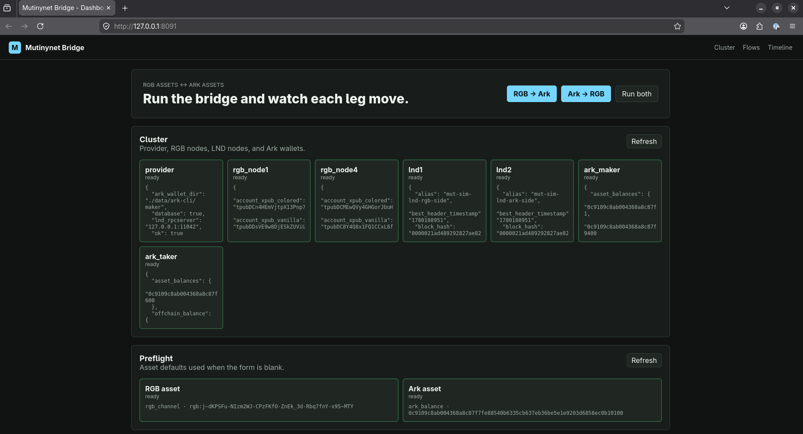 | 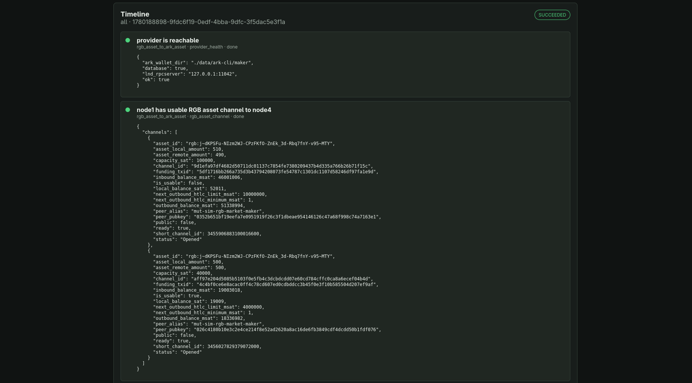 |
| 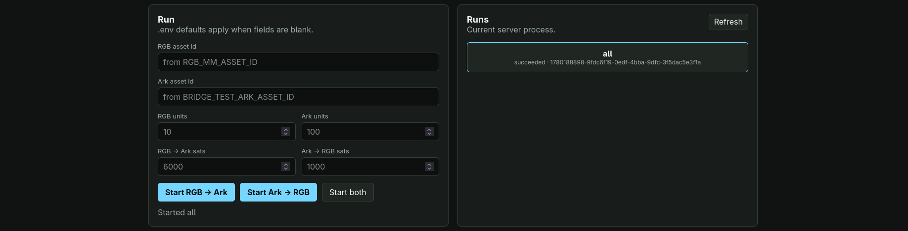 | 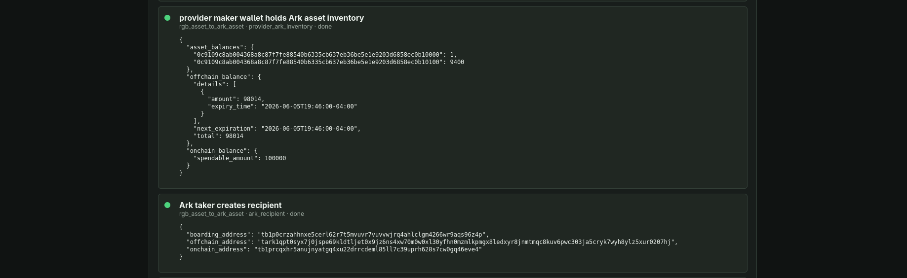 |
| 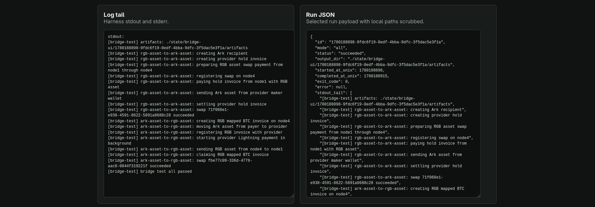 | 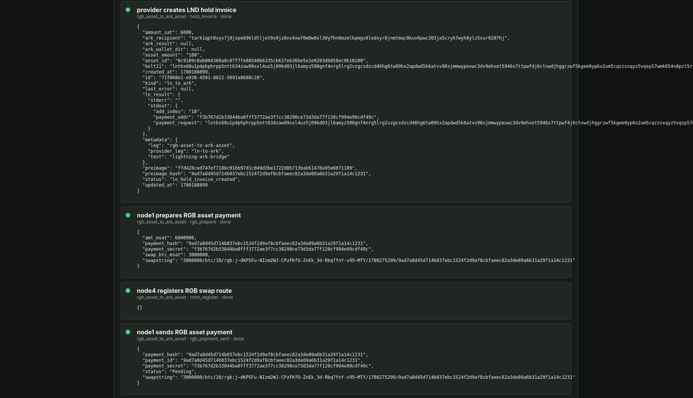 |
|  | 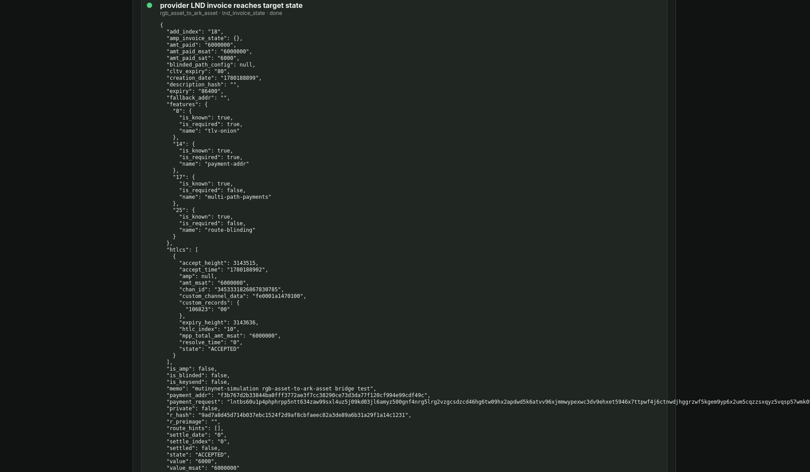 |
|  | 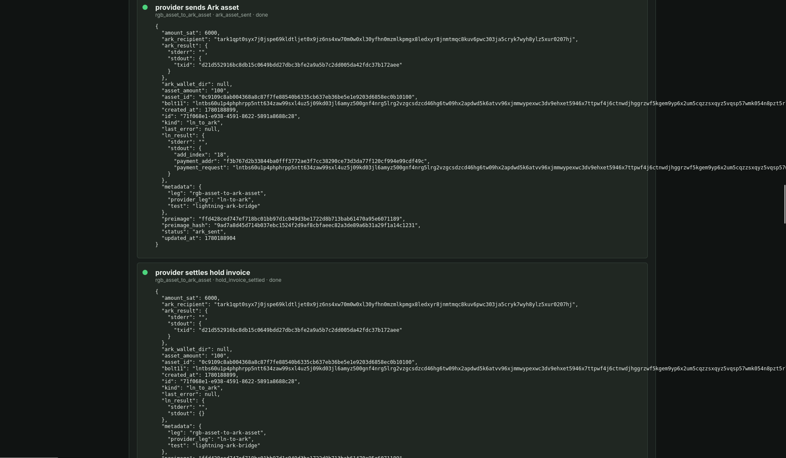 |
|  | 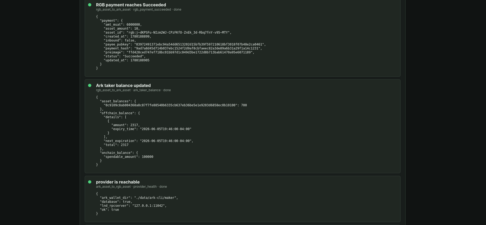 |

| Ark -> RGB | Completion |
| --- | --- |
| 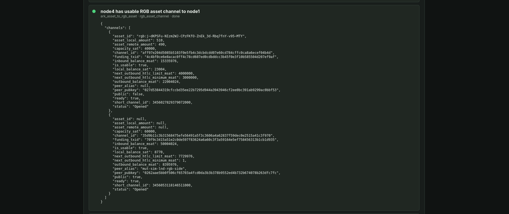 | 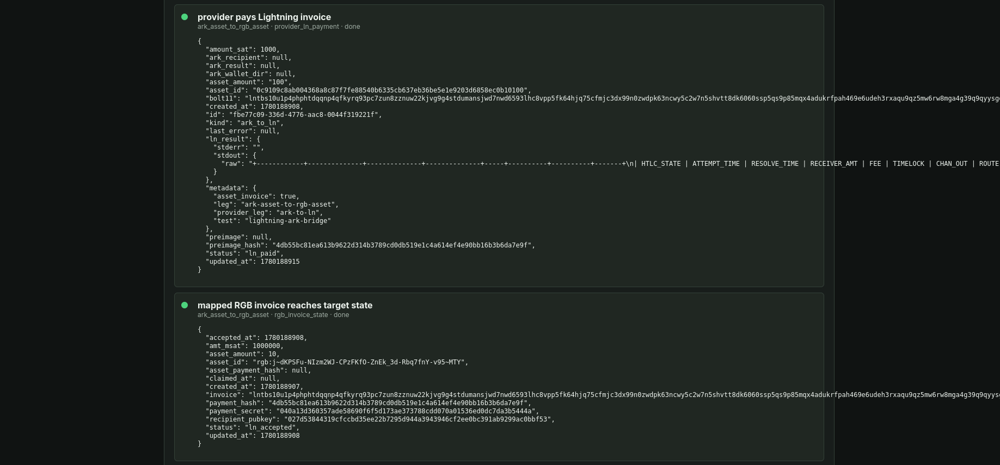 |
| 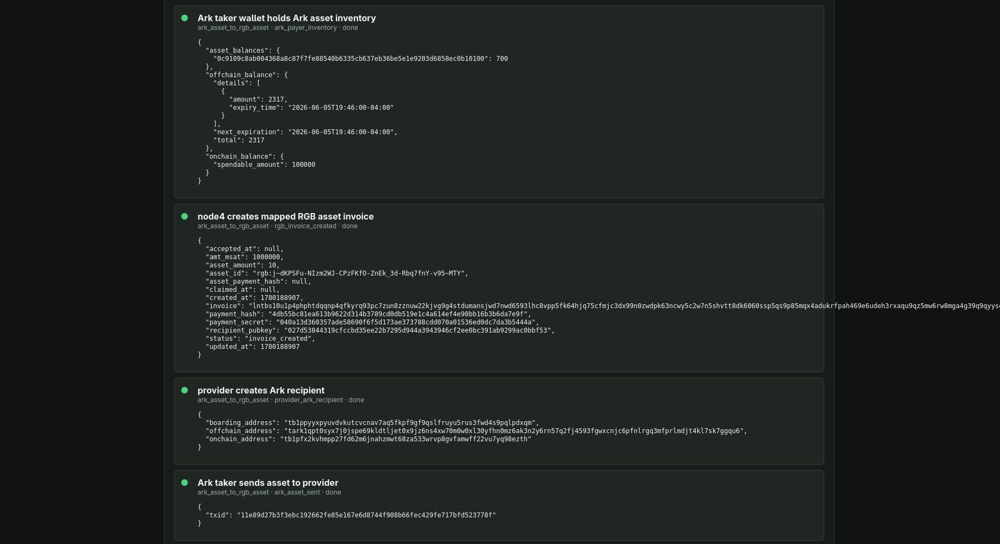 | 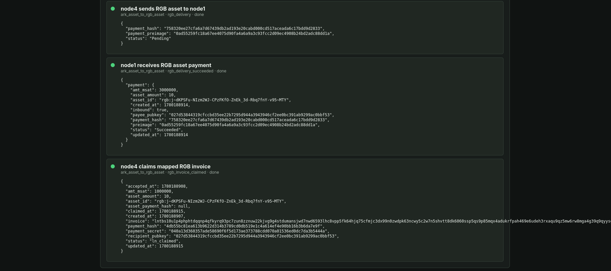 |
| 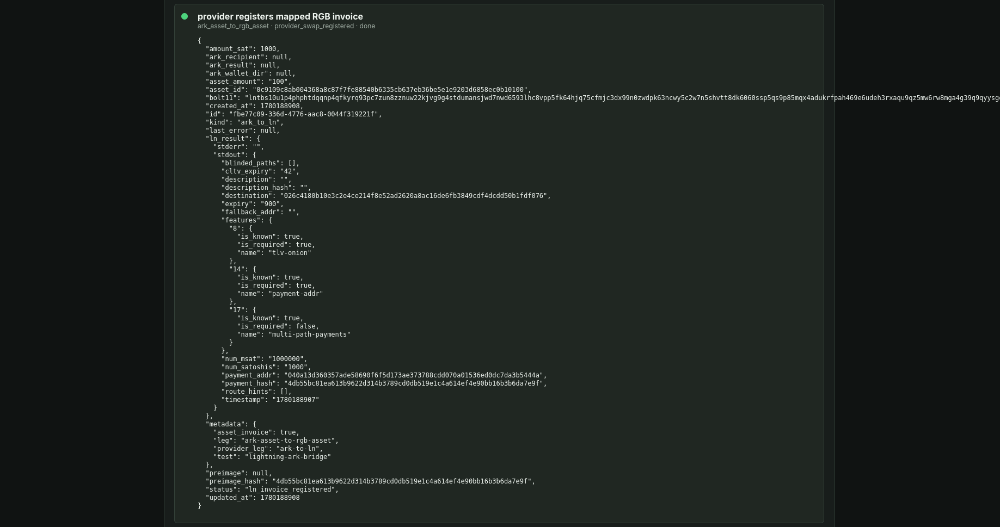 |  |

## Topology

```text
                         Mutinynet Bitcoin Core
                     RPC / P2P / ZMQ / indexers
                                  |
                                  v

node1  <===== RGB asset channel =====>  node4 / rmm
 RGB wallet                              RGB market maker
                                             |
                                             | BTC Lightning
                                             v
                                           lnd1
                                             |
                                             | BTC Lightning
                                             v
                                           lnd2
                                             |
                                             v
                                      ark-lnd-provider
                                      Ark + LND2 only
                                             |
                                             v
                                      arkd / Ark wallets
```

## Mechanics

| RGB -> Ark | What moves |
| --- | --- |
| `hold invoice` | provider locks the Lightning leg |
| `RGB asset payment` | node1 pays through node4/rmm |
| `LND invoice accepted` | provider sees the held BTC invoice |
| `Ark asset send` | provider sends Ark asset to taker |
| `hold invoice settled` | preimage completes the Lightning leg |

| Ark -> RGB | What moves |
| --- | --- |
| `Ark asset send` | taker sends Ark asset to provider |
| `mapped RGB invoice` | node4 creates the RGB-side BTC invoice |
| `provider pays LND invoice` | provider starts the Lightning leg |
| `RGB asset delivery` | node4 sends RGB asset to node1 |
| `mapped invoice claimed` | node4 claims the BTC invoice |

The provider maps Ark-side asset movement to Lightning invoices controlled by
`lnd2`. RGB asset preparation, delivery, and claiming stay in the RGB Lightning
node APIs.

| Piece | Current proof |
| --- | --- |
| RGB side | RGB Lightning node APIs create, prepare, send, deliver, claim, and report asset payment state. |
| LND side | Provider drives hold invoices, invoice payment, and settlement through `lncli`. |
| Ark side | Provider and harness coordinate `ark` CLI sends. This is not yet a contract-bound VTXO swap. |

## Run The UI

Inside the dev shell:

```bash
nix develop
sim-bridge-ui
```

From a plain shell:

```bash
nix run .#bridge-ui
```

If the shell was already open before the aliases were added:

```bash
source ./alias.sh
sim-bridge-ui
```

Then open the UI. The JSON API is still available for scripts:

```bash
xdg-open http://127.0.0.1:8091/
curl -sS http://127.0.0.1:8091/api/cluster | jq
curl -sS -X POST http://127.0.0.1:8091/api/flows/start/rgb-asset-to-ark-asset | jq
curl -sS -X POST http://127.0.0.1:8091/api/flows/start/ark-asset-to-rgb-asset | jq
curl -sS http://127.0.0.1:8091/api/flows/<run-id> | jq
```

For screenshots, run `all` and capture cluster health, preflight, the succeeded
run row, the timeline, and the run JSON panel. The UI keeps protocol
identifiers visible and scrubs local filesystem paths.

Repeated local runs move Lightning liquidity. If RGB -> Ark fails with
`insufficient bandwidth`, pay a normal invoice from `lnd2` to `lnd1`, then run
`all` again.

## Boundary

| Area | Current proof | Trustless target |
| --- | --- | --- |
| LND access | `lncli` adapter | direct LND gRPC client |
| Ark access | `ark` CLI adapter | direct Ark gRPC/client SDK path |
| Atomicity | coordinated send and settle | Ark VTXO contract bound to the RGB/LN preimage |
| Proof | baseline mapped-asset transcript | success and refund artifacts for both directions |

The trustless design is captured in
[docs/trustless-ark-swap.md](docs/trustless-ark-swap.md). It requires Ark asset
VTXOs with claim/refund paths, shared preimage checks, watcher evidence, and a
fresh harness run before the README can claim a trustless swap.

## Repo Map

| Path | Purpose |
| --- | --- |
| [USAGE.md](USAGE.md) | setup, flake commands, configuration |
| [docs/proofs/](docs/proofs/) | public proof artifacts |
| [docs/trustless-ark-swap.md](docs/trustless-ark-swap.md) | Ark contract-bound swap design |
| [scripts/](scripts/) | cluster lifecycle and bridge harness |
| [providers/ark-lnd-swap-provider/](providers/ark-lnd-swap-provider/) | Ark/LND coordinator |
| [tools/bridge-ui/](tools/bridge-ui/) | Maud-rendered control plane for running bridge flows |
| [.env.example](.env.example) | documented runtime knobs |
| [LICENSE](LICENSE) | MIT license |

## Future Work

```text
              quote service
        price / route / fee / expiry
                    |
   +----------------+----------------+
   |                |                |
 RGB assets     Ark assets     Taproot Assets
   |                |                |
   +----------------+----------------+
                    |
              small payment UI
        choose in -> quote -> pay -> receipt
```

- Implement the Ark contract-bound VTXO path and rerun the proof harness.
- Replace CLI adapters with LND and Ark gRPC/protobuf clients.
- Add a [Taproot Assets](https://github.com/lightninglabs/taproot-assets)
  example that pays to and from Ark and RGB assets.
- Add quoting for inventory, rates, routes, fees, expiries, and min/max amounts.
- Extend the bridge UI into a small payment view.
- Add cleanup helpers for stale channels and RGB/LDK state.
